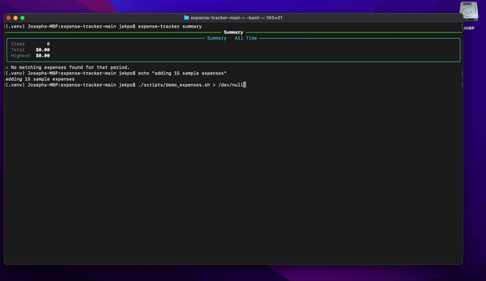

# Expense Tracker CLI

A simple command-line expense tracker built with Python.

This project lets you add expenses, store them locally, view spending summaries, and export data to CSV. It was built as a practical Python project to practice CLI development, file persistence, project structure, and testing.

---

## Command Examples


---

## Demo
_Commands can also be ran as a script_



## Features

- Add expenses with description, amount, date, and category
- Store expenses locally in a JSON file
- List saved expenses in a formatted terminal table
- Update or delete expenses by ID
- View spending summaries by month and/or year
- Export expenses to CSV
- Includes pytest tests for core service logic

---

## Tech Stack

| Tool | Purpose |
|---|---|
| Python | Core language |
| Typer | CLI commands |
| Rich | Terminal tables/output |
| JSON | Local data storage |
| CSV | Data export |
| Pytest | Testing |

---

## Project Structure

```text
expense-tracker-main/
├── expense_tracker/
│   ├── expense.py          # Core expense logic
│   ├── expense_tracker.py  # CLI commands
│   └── styles.py           # Rich output helpers
├── tests/                  # Pytest test files
├── docs/assets/            # README screenshots/GIFs
├── pyproject.toml
└── README.md
```

---

## Installation

Clone the repo:

```bash
git clone <your-repo-url>
cd expense-tracker-main
```

Create and activate a virtual environment:

```bash
python3 -m venv .venv
source .venv/bin/activate
```

Install the project:

```bash
python -m pip install -e .
```

Confirm it works:

```bash
expense-tracker --help
```

---

## Usage

Add an expense:

```bash
expense-tracker add --description "Ralphs groceries" --amount 47.83 --date 2026-04-21 --category groceries
```

List expenses:

```bash
expense-tracker ls
```

Update an expense:

```bash
expense-tracker update --id 1 --description "Ralphs groceries" --amount 52.10 --date 2026-04-20 --category groceries
```

Delete an expense:

```bash
expense-tracker delete 1
```

View a monthly summary:

```bash
expense-tracker summary --month 4 --year 2026
```

View a complete summary:

```bash
expense-tracker summary
```

Export to CSV:

```bash
expense-tracker export-csv --saveto ./exports/april-expenses.csv
```

---

## Data Storage

Expenses are saved locally at:

```text
~/.expense-tracker/expenses.json
```

Example expense:

```json
{
  "id": 1,
  "description": "Ralphs groceries",
  "amount": 47.83,
  "date": "2026-04-21",
  "category": "groceries"
}
```

---

## Testing

Run the test suite:

```bash
pytest
```

The tests use temporary files so they do not modify the real expense data file.

---

## What I Learned

This project helped me practice:

- Building an installable Python CLI project
- Separating CLI code from business logic
- Reading and writing JSON data
- Using `pathlib` for file paths
- Exporting data to CSV
- Writing tests with pytest fixtures
- Preparing a project for GitHub and portfolio review

---

## Author

Built by Joseph Ekpo | [LinkedIn](https://www.linkedin.com/in/joseph-ekpo-026bb3161/ "View on LinkedIn")

